# 📊 Excel-1


## ✨ Project Description

**Excel-1** is a guide to advanced features and tricks in Microsoft Excel. Here you'll find practical tips, instructions, and illustrations about working with ranges, Auto Fill, custom lists, Flash Fill, and modern formulas such as `TEXTSPLIT` and `SEQUENCE`.

> 📚 **Goal:** Help you use Excel more efficiently every day—suitable for both beginners and advanced users!

---

## 📒 Table of Contents

- [Ranges in Excel](#-ranges-in-excel)
- [AutoFit (Automatic Column Width)](#-autofit-automatic-column-width)
- [Auto Fill](#-auto-fill)
- [Custom Auto Fill List](#-custom-auto-fill-list)
- [Flash Fill](#-flash-fill)
- [TEXTSPLIT Function](#-textsplit-function)
- [SEQUENCE Function](#-sequence-function)
- [📷 Screenshots](#-screenshots)
- [ℹ️ Requirements](#-requirements)
- [👨‍💻 Author](#-author)

---

## 🔲 Ranges in Excel

A range in Excel is a group of two or more cells.  
To fill a range:
1. Select a cell with a value or formula.
2. Grab the small square in the bottom right corner and drag it.

> 📝 **Tip:** When you drag, Excel automatically recognizes patterns (formulas/numbers/dates) and extends them.

To move a range:
- Select the range, click its border, and drag it to a new location.

To insert/delete rows or columns:
- Right-click the row/column header and choose _Insert/Delete_.

To change column width:
- Drag the right edge of the header.
- Double-click the edge to auto fit to the longest content.

---

## ↔️ AutoFit (Automatic Column Width)

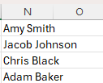
*Initial column width.*

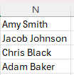
*AutoFit to the longest entry.*

To automatically fit column width to its content, **double-click** the right edge of the column header.

---

## 🔄 Auto Fill

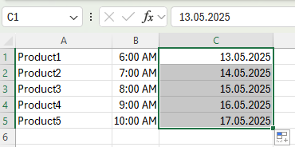
*Example of auto-filling formulas, times, and dates.*

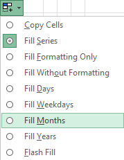
*Auto Fill options for dates.*


*Result of filling months.*

---

## 📝 Custom Auto Fill List

You can create your own list for quick auto-filling.

1. File → Options → Advanced → General → **Edit Custom Lists**.

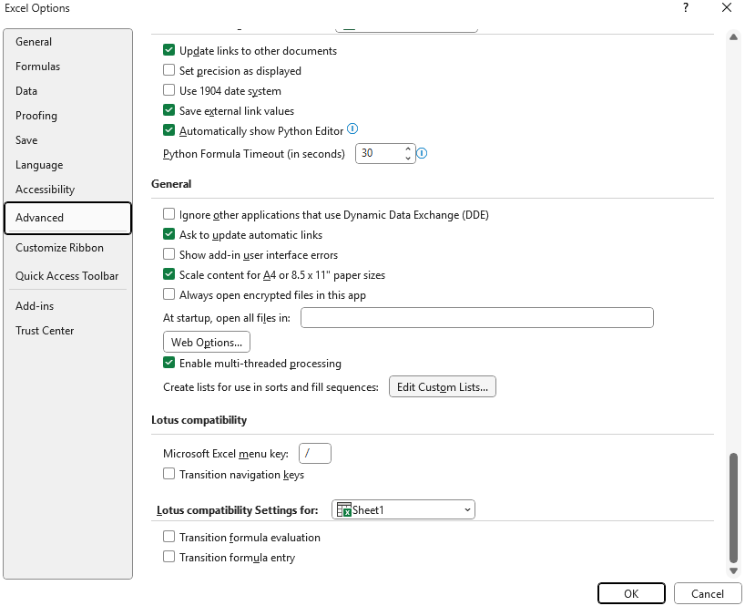

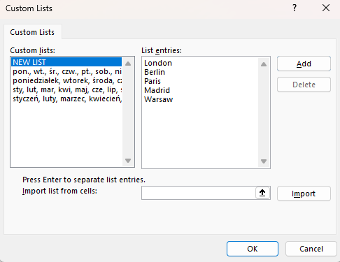
*Add your own list here.*

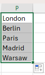
*Effect: type e.g. "London" in a cell, drag, and the list will fill automatically.*

> ℹ️ **Note:** Custom lists are stored in the system registry and can be used in other workbooks.

---

## ⚡ Flash Fill

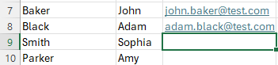
*Creating emails from a pattern.*

1. Type an example result next to your data.
2. Select the cell and press **CTRL + E** (Flash Fill shortcut).

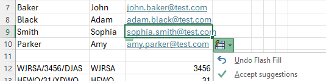
*Flash Fill in action.*

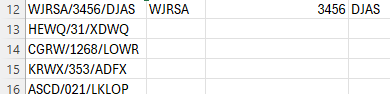
*Splitting one cell into several.*

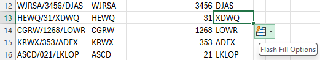
*Final result—press CTRL+E in each column.*

> ⚠️ **Remember:** Flash Fill results do not update automatically if source data changes. For dynamic results, use formulas!

---

## 🧩 TEXTSPLIT Function

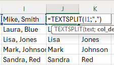

Instead of Flash Fill, you can use this formula:
```excel
=TEXTSPLIT(text, column_separator)
```
- Available only in Excel 365/2021!
- Fills multiple cells at once (spilling).

---

## 🔢 SEQUENCE Function

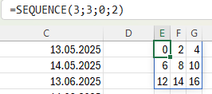

This function generates a sequence of numbers:
```excel
=SEQUENCE(rows, columns, start, step)
```
- Only in Excel 365/2021!
- Fills multiple cells at once.

---

## 📷 Screenshots

You can find all screenshots in the `/Screenshots` folder.

---

## ℹ️ Requirements

- Microsoft Excel (recommended: 2021/365 for modern formulas)
- Windows OS (for custom lists)

---

## 👨‍💻 Author

Project and documentation by **Kuba27x**  
Repository: [Kuba27x/Excel-1](https://github.com/Kuba27x/Excel-1)

---
